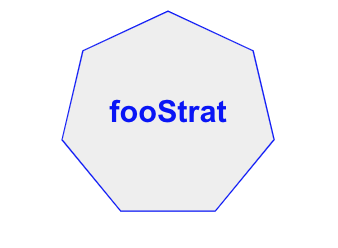
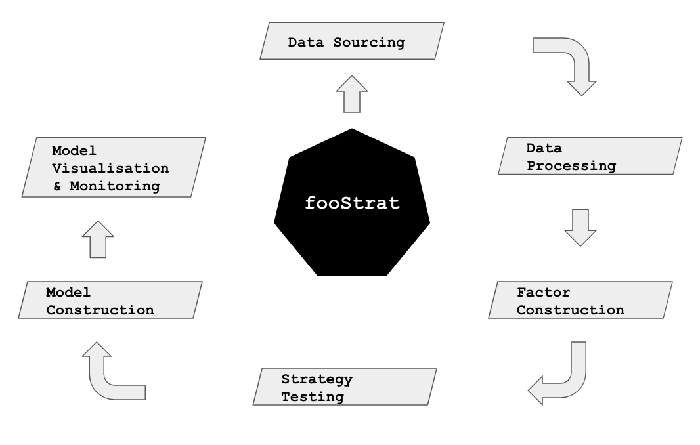

# fooStrat 
Statistical analysis and strategy development for football data

<p align="center">
  
</p>


**Core**

> Data sourcing ```data_sourcing```

> Prepare/update data ```data_processing```

> Compute all factors ```factor_construction```

> Model building ```model_construction``` (..work in progress)

> Test strategies ```strats_testing```


**Utilities**

> Functions and other support material required to perform data cleaning, calculations etc. ```foostrat_utils```

> Daily ETL Process ```job_schedule.py```


Agenda
------

- [x] consolidate data into single file
- [x] calculate standings tables
- use scrapy to crawl player data from fifa website
- construct automatic data update ETL
- create a factor library (stats / factors by team: date | team | field | val)
- two types of bets: outcome (h, d, a), goals (later: 1st / 2nd half results, goals)
- approach: compute derived probabilities and compare to offered odds - take positions in the most extreme deviations


Data & Research Sources
-----------------------

- onlinebettingacademy.com
- football-data.co.uk
- tennis insight
- betgps.com


